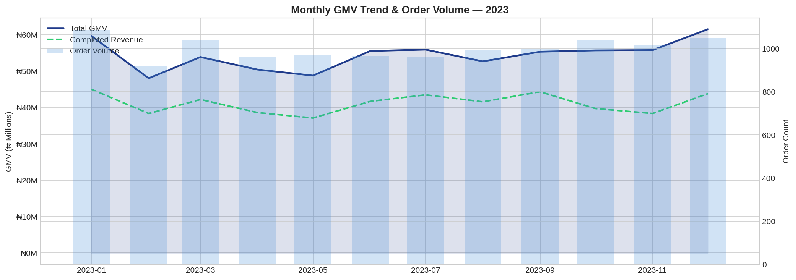
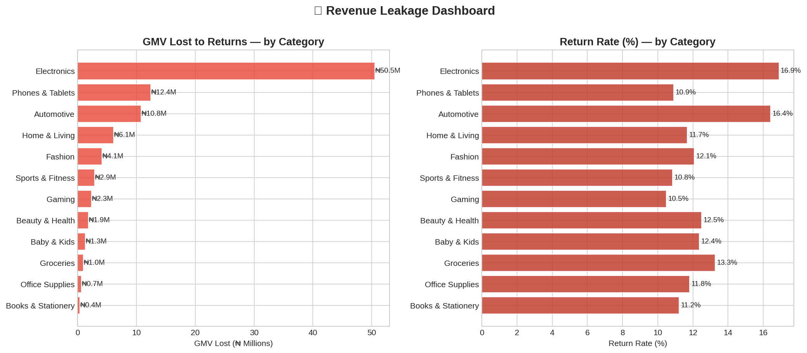
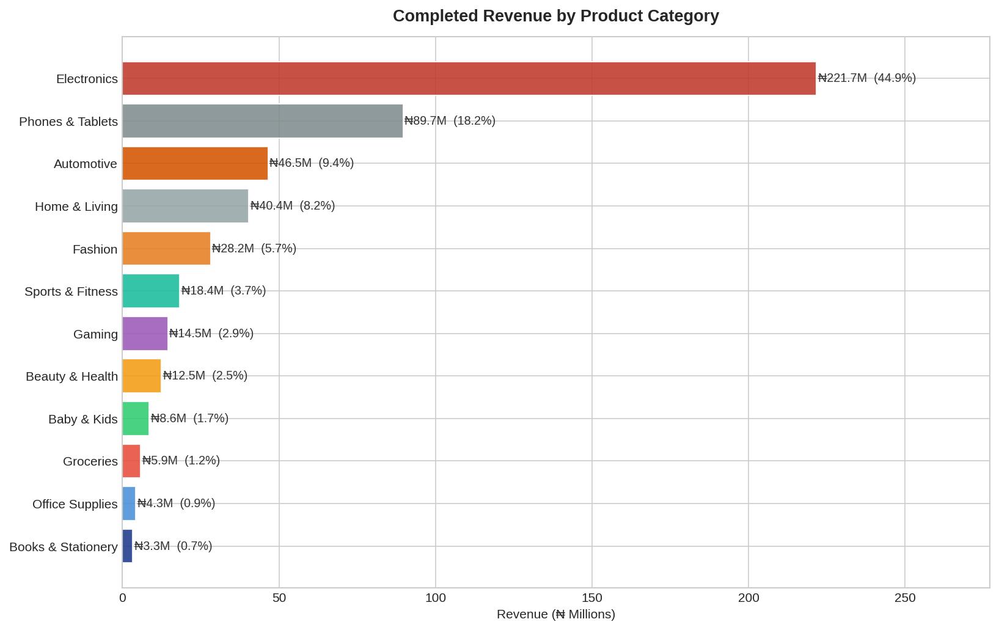
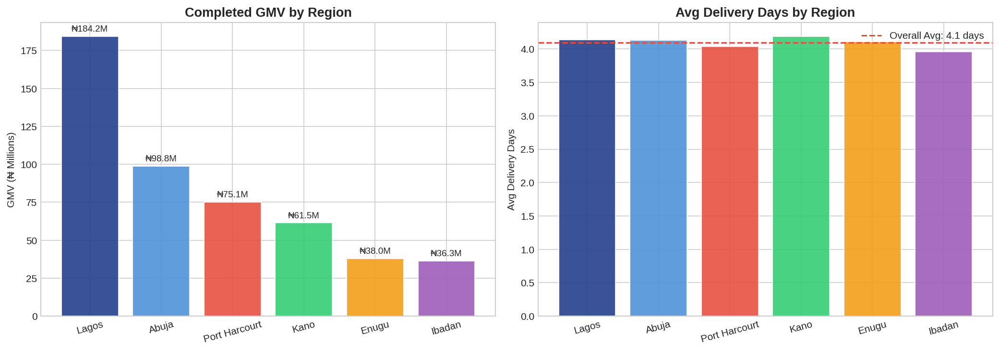

# E-Commerce Sales Performance Analysis

   

> **End-to-end sales analysis of ₦494M+ GMV across 12 categories, 6 regions, and 4 channels — with SQL-powered star-schema consolidation and ₦18M revenue leakage uncovered.**

---

## Project Overview

A Nigerian e-commerce platform running across **Lagos, Abuja, Port Harcourt, Kano, Enugu, and Ibadan** had data scattered across 3 separate operational systems — Orders, Customers, and Logistics. This project consolidates all 3 into a unified star-schema model using SQL JOINs, then performs full sales performance analysis to answer key business questions and surface a **₦18M+ revenue leakage** from returns and cancellations.

---

## Business Questions Answered

1. Which product categories generate the most revenue?
2. Which regions and channels are driving growth?
3. Where is revenue leaking — and why?
4. Which customer segments are most valuable?
5. What does the monthly GMV trend look like?

---

## Key Findings

| Finding | Impact |
|---------|--------|
| **Phones & Tablets + Electronics = 34% of GMV** | Top 2 categories dominate revenue |
| **Lagos accounts for ~38% of national GMV** | Highest priority region for fulfilment investment |
| **₦18M+ lost to returns & cancellations** | Electronics Q4 return spike is the primary driver |
| **Mobile App is the #1 revenue channel** | 45% of orders, highest avg order value |
| **VIP customers spend 2x the average** | Loyalty programme has clear ROI |

---

## 📊 Sample Visualisations

### Monthly GMV Trend (2023)


### Revenue Leakage by Category


### Category Revenue Breakdown


### Regional Performance


---

## Project Structure

```
ecommerce-sales-analysis/
├── data/
│   ├── ecommerce.db          # SQLite database (3 tables: orders, customers, logistics)
│   ├── orders.csv
│   ├── customers.csv
│   └── logistics.csv
├── notebooks/
│   └── ecommerce_analysis.ipynb  # Full analysis notebook
├── sql/
│   └── analysis_queries.sql  # All SQL queries used (star schema, leakage, segments)
├── outputs/
│   └── *.png                 # All visualisation exports
└── README.md
```

---

## Tools & Stack

| Layer | Tool |
|-------|------|
| Data Storage | SQLite (3 source tables → star schema) |
| Data Manipulation | Python, Pandas, NumPy |
| Visualisation | Matplotlib, Seaborn |
| Query Language | SQL (JOINs, CTEs, Window Functions) |
| Environment | Jupyter Notebook |

---

## How to Run

```bash
git clone https://github.com/Canigbobi1/ecommerce-sales-analysis.git
cd ecommerce-sales-analysis
pip install pandas numpy matplotlib seaborn
jupyter notebook notebooks/ecommerce_analysis.ipynb
```

---

## 👤 Author

**Churchill Anigbobi** — Data Analyst | SQL & Python 

- 🌐 [LinkedIn](https://www.linkedin.com/in/churchill-anigbobi-1bba3b179/)
- 🐙 [GitHub](https://github.com/Canigbobi1)
- 📧 canigbobi@gmail.com

---
*Dataset is synthetic, modelled on realistic Nigerian e-commerce patterns. Built for portfolio demonstration.*
